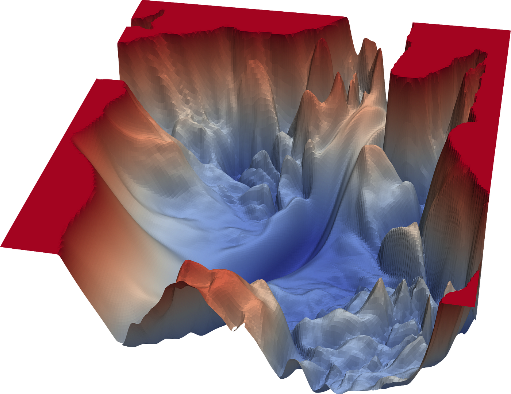
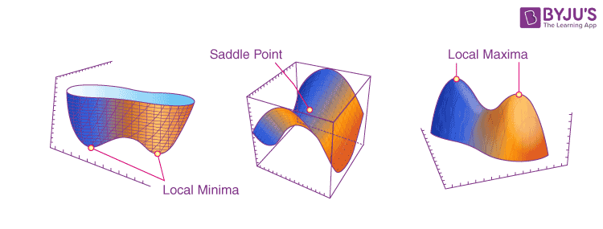
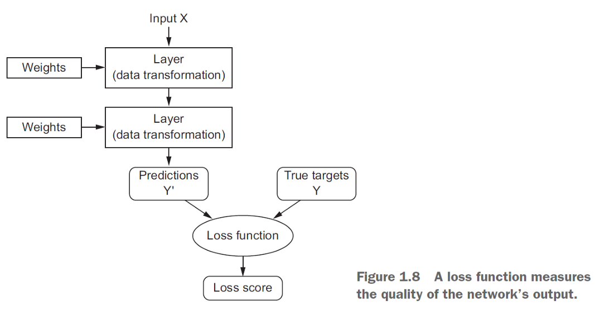

# Notes on Natural Gradients

Natural gradients are a technique that adjusts the weights during training.
It takes into account the geometry or curvature of the loss landscape.

### What is the Loss Landscape?
* The loss landscape, refers to the graphical representation of the loss function, with respect to the model's parameters. 
* The loss function measures the difference between the predicted output of the model and the actual target values. 
* The loss landscape shows how changes in the model's parameters affect the performance of the network.

#### The 4 Key Components of Loss Landscape
1. Dimensions - General size of landscape represents the varying parameters/weights of the NN. In high dimensional spaces, the landscape becomes more complex.
2. Topology - Refers to shape and structure of the landscape. May contain multiple minima, maxima, 
and saddle points, all of which influences the training complexity. 
 
3. Global/Local Minima - We are particularly interested in the minima of our landscape. Global minima refers to the points in the landscape where the loss function is at its lowest.    
4. Saddle Points - These are points where the loss landscape flattens out in some directions, but curves downward in others. Training could get stuck at these saddle points, thus affecting convergence.

#### Loss Function

Unlike the traditional gradient descent, which uses the first-order gradient information, natural gradients incorporate second-order information, specifically the Fisher information matrix, to guide the optimization process.

Natural gradients optimize NN training by taking into account not only the direction of steepest ascent but also the curvature of the loss landscape. 

This can lead to more efficient and stable convergence, especially in scenarios where the traditional gradient descent might face challenges.