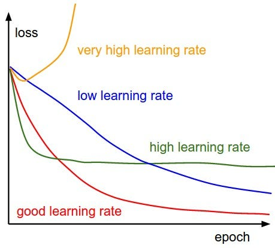

# Notes on Natural Gradients

Natural gradients are a technique that adjusts the weights during training.
It takes into account the geometry or curvature of the loss landscape.
During training, the natural gradient navigates this landscape, and while doing so, adjusts the parameters to minimize the loss.

### What is the Loss Landscape?
* The loss landscape refers to the graphical representation of the loss function, with respect to the model's parameters. 
* The loss function measures the difference between the predicted output of the model and the actual target values. 
* The loss landscape shows how changes in the model's parameters affect the performance of the network.

#### The 4 Key Components of Loss Landscape
1. Dimensions - General size of landscape represents the varying parameters/weights of the NN. In high dimensional spaces, the landscape becomes more complex.
2. Topology - Refers to shape and structure of the landscape. May contain multiple minima, maxima, 
and saddle points, all of which influences the training complexity. 
 
3. Global/Local Minima - We are particularly interested in the minima of our landscape. Global minima refers to the points in the landscape where the loss function is at its lowest.    
4. Saddle Points - These are points where the loss landscape flattens out in some directions, but curves downward in others. Training could get stuck at these saddle points, thus affecting convergence.

#### Loss Function

A loss function recieves the accumulated error (difference between prediction and true value) for each input at the end of every epoch. An **epoch** is defined as the number of times the entire training dataset is passed through the network. As the value of epoch increases, the more number of times the weights are being adjusted, and we go from underfitting to overfitting. Generally, the loss/cost should decrease as epoch increases, at least up until a certain point.

It should be noted that there are a wide variety of loss functions, depending on which algorithm you use. One common loss function is MSE (mean squared error). It takes the squared sum of residuals and divides by the number of datapoints (thus obtaining an average). This loss function outputs a loss score, which could be plotted against epoch to determine a suitable learning rate.   

#### Natural Gradient Summary
Unlike the traditional gradient descent, which uses the first-order gradient information, natural gradients incorporate second-order information, specifically the Fisher information matrix, to guide the optimization process.

Natural gradients optimize NN training by taking into account not only the direction of steepest ascent but also the curvature of the loss landscape. 

This can lead to more efficient and stable convergence, especially in scenarios where the traditional gradient descent might face challenges.